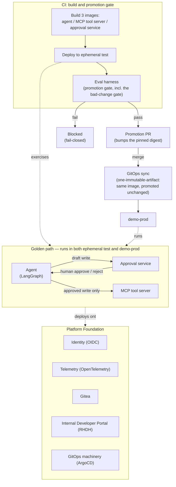

# Golden-Path Agent Template

## What this is

This repository is the golden path for a deliberately constrained
agentic-AI pattern: one LangGraph agent, gated behind a single MCP
(Model Context Protocol) tool contract, with a human-approval gate on
every write and an evaluation harness wired in as a CI promotion gate. Nothing here is a
general-purpose agent framework — every capability is a fixed, minimal
slice chosen to prove the pattern end to end, not to be feature-complete.
The pattern is realized as three independently built, independently
promoted OCI images — the agent, the MCP tool server, and the approval
service — plus a shared Platform Foundation (identity, telemetry, Gitea,
the Internal Developer Portal, and the GitOps machinery) that all three
deploy onto but that isn't itself one of the three artifacts. Each image
is built exactly once in CI and promoted unchanged from an ephemeral test
environment to demo-prod (the one-immutable-artifact rule) — every
environment difference lives only in config, secrets, policy bundles, and
bindings, never in the image itself.

This template intentionally ships **without** a knowledge corpus, domain
prompts, or real domain tools — those are the pieces every future use
case supplies. See [`TODO_DOMAIN.md`](TODO_DOMAIN.md) for the exact list
of what to fill in.

## Architecture at a glance



## Repo map

### The blueprint

The agent, its one tool, its approval gate, and everything that builds,
tests, deploys, and evaluates them.

| Path | What it is |
|---|---|
| [`agent/`](agent/) | The LangGraph agent: `decide` → `retrieve`/`tool_invoke` → `human_approval` → `respond`, with a deterministic fallback path. |
| [`mcp_server/`](mcp_server/) | The one MCP tool contract — a mock ITSM tool with persistent state. |
| [`approval_service/`](approval_service/) | The human-approval gate: a human approver explicitly approves or rejects every write before it executes. Independently built and promoted since Phase D, same as the agent and the MCP tool server. |
| [`deploy/`](deploy/) | Kustomize base + overlays and ArgoCD `Application` manifests for the ephemeral test and demo-prod environments. |
| [`pipelines/`](pipelines/) | Tekton `Pipeline`/`Task` definitions for each of the three components' independent build → test → promote pipeline. |
| [`platform/`](platform/) | Platform Foundation bootstrap manifests and scripts — identity (Keycloak), Gitea, the Internal Developer Portal (RHDH), and the cluster-tier OpenTelemetry collector. |
| [`policy/`](policy/) | Baseline policy and approval-rule bundles the agent and approval service load at runtime. |
| [`eval/`](eval/) | The evaluation harness — the CI promotion gate (`python -m eval.cli run --all`) plus the domain eval-case set. |
| [`corpus/`](corpus/) | The synthetic RAG corpus the agent retrieves against. |
| [`docs/`](docs/) | Deeper architecture, environment, and operational reference — see [Docs index](#docs-index) below. |
| [`scripts/`](scripts/) | Operator-facing entry points: the local dev loop (`dev.sh`) and the fresh-cluster install sequence (`bootstrap.sh`, `install.sh`). |
| [`tools/`](tools/) | One-off operator and diagnostic scripts (trace queries, skeleton verification, Gitea publish, credential helpers). |
| [`skeleton/`](skeleton/) | The single-service scaffolding template a new agent project is instantiated from. |
| [`skeleton-tools/`](skeleton-tools/) | The single-tool-server scaffolding template a new MCP tool project is instantiated from. |
| [`ci/`](ci/) | The pull-request check pipeline definition (`pr-checks.yaml`): unit tests, the offline eval gate, container build, SBOM. |
| [`tests/`](tests/) | Unit and integration tests for the agent, MCP tool server, and approval service. |

`state/` is created at runtime (git-ignored) for the approval service's
local SQLite store — it doesn't exist in a fresh clone and has no
tracked content to link to.

### The build journal

This project keeps its own engineering forensics alongside the code — an
append-only decision log plus phase-by-phase handoff and pin records —
so a decision's reasoning, not just its outcome, survives past the
session that made it. It reads as intentional because it is: every
`DEC-NNN` comment in the code points back here on purpose.

| Path | What it is |
|---|---|
| [`DECISIONS.md`](DECISIONS.md) | The append-only decision log — every `DEC-NNN` entry records one ambiguity, finding, decision, evidence, and status. |
| [`HANDOFF.md`](HANDOFF.md) | Session-to-session handoff notes for whoever picks up the work next. |
| [`PINS.md`](PINS.md) | Pinned exact versions/commits for every external component this repo builds on, with source URL and date verified. |
| [`reports/`](reports/) | Per-task verification reports: commands run, real output, eval scores, what failed and why. |
| [`MISSION_UNATTENDED.md`](MISSION_UNATTENDED.md) | The standing instructions an unattended/autonomous session runs under. |
| [`srs/`](srs/) | The normative system/stakeholder requirements this blueprint realizes. |

### Other root files

Build and packaging plumbing that doesn't belong to either group above.

| Path | What it is |
|---|---|
| [`Makefile`](Makefile) | Every make target used in this README (`up-offline`, `eval-fast`, `test`, `up`, `eval`, `bootstrap`, ...). |
| [`Containerfile.agent`](Containerfile.agent), [`Containerfile.mcp`](Containerfile.mcp), [`Containerfile.approval`](Containerfile.approval) | The three independent image build definitions, one per artifact. |
| [`entrypoint-agent.sh`](entrypoint-agent.sh), [`entrypoint-mcp.sh`](entrypoint-mcp.sh), [`entrypoint-approval.sh`](entrypoint-approval.sh) | Each image's container entrypoint. |
| [`requirements.txt`](requirements.txt), [`requirements-agent.txt`](requirements-agent.txt), [`requirements-mcp.txt`](requirements-mcp.txt), [`requirements-approval.txt`](requirements-approval.txt), [`requirements-dev.txt`](requirements-dev.txt) | Pinned Python dependencies, split per component plus a dev set. |
| [`template.yaml`](template.yaml), [`template-schema.json`](template-schema.json), [`template-tools.yaml`](template-tools.yaml), [`template-schema-tools.json`](template-schema-tools.json) | Backstage/RHDH software-template definitions used to scaffold a new agent project (from `skeleton/`) or tool project (from `skeleton-tools/`) out of this blueprint. |
| [`catalog-info.yaml`](catalog-info.yaml) | This repo's own Backstage/RHDH catalog entry. |
| [`.env.example`](.env.example) | The local-dev environment template Quickstart A copies from. |
| [`pyproject.toml`](pyproject.toml) | Shared Python project metadata/tooling config. |
| [`TODO_DOMAIN.md`](TODO_DOMAIN.md) | The exact list of domain-specific pieces (corpus, prompts, tools) a real use case must supply. |
| [`SHOWCASE_NOTES.md`](SHOWCASE_NOTES.md) | Operator notes for running a live demo on the showcase cluster. |

## Quickstart A — laptop (no cluster, no network)

Requires a container engine (`podman` or `docker`) and Python 3. Nothing
here talks to a real model or a real cluster.

```sh
cp .env.example .env
make up-offline      # fake model client + mock MCP tool, no network required
make eval-fast        # offline harness-mechanics smoke pair (EXAMPLE-001/002)
make test             # unit + integration test suite
make down              # tear down the three dev containers
```

Verified against this repo's actual `Makefile`: `make test` passes
(253 passed, 1 skipped), `make eval-fast` passes (`2/2 cases passed`),
and `make up-offline` brings up all three containers and answers a real
HTTP request end to end — see
[`reports/feature-h1-readme-rewrite.md`](reports/feature-h1-readme-rewrite.md)
for the full commands-and-output transcript.

**Live-model variant**: edit `.env` (`MODEL_API_BASE_URL`, `MODEL_NAME`,
`MODEL_API_KEY`, and the fallback route —
`MODEL_FALLBACK_API_BASE_URL`/`MODEL_FALLBACK_NAME`) and run `make up`
instead of `make up-offline`. Once live, `make eval` is the real promotion gate —
`eval-fast`'s offline pair plus the full domain eval-case set
(`eval-domain`) against the real model, scored under a
deterministic-sampling gate contract (see `DECISIONS.md` `DEC-017`).
The domain categories need a live model to be meaningful: the fake
client doesn't simulate real reasoning, tool selection, or citation.

## Quickstart B — fresh OpenShift cluster

**Prerequisites**: an already-authenticated kubeconfig (this path never
runs `oc login` for you — authenticate first, the same way you would for
any other `oc` command), a model-endpoint credential, and cluster-admin
on the target cluster.

**Primary path** — one command:

```sh
./scripts/install.sh <kubeconfig-path>
```

This runs `scripts/bootstrap.sh` (operators, namespaces, RBAC, identity,
telemetry, pipelines, the ArgoCD app-of-apps root) and then
`platform/bootstrap/provision-identity-secrets.sh` (OIDC client secrets
and demo-user passwords), in that order, stopping immediately and naming
the failing script if either exits non-zero. Pass `--yes` to skip the
interactive confirmation described in the warning box below (both
scripts still run either way — `--yes` only removes the prompt).

**Alternative** — run the two underlying scripts by hand:

```sh
./scripts/bootstrap.sh <kubeconfig-path>
./platform/bootstrap/provision-identity-secrets.sh
```

(`make bootstrap CLUSTER=<kubeconfig-path>` is equivalent to the first
line alone, without the second script.)

> **Before you run either path, read this:**
>
> 1. **Re-running the identity/secrets provisioning script rotates
>    credentials and invalidates live sessions.**
>    `platform/bootstrap/provision-identity-secrets.sh` regenerates the
>    OIDC client secrets and demo-user passwords on *every* run, by
>    design — there is no "only if missing" branch (`DECISIONS.md`
>    `DEC-059`). Safe on a fresh install; on an already-live cluster,
>    anyone currently signed in gets signed out.
> 2. **`scripts/bootstrap.sh`'s `--reenable-sync` flag exists because
>    auto-sync may be deliberately frozen on a cluster.** A cluster's
>    GitOps auto-sync can be intentionally disabled to make it the sole
>    active environment for a shared digest pin; a plain re-run of
>    `bootstrap.sh` detects that freeze and skips re-applying the
>    ArgoCD root `Application` rather than silently reversing it. Only
>    pass `--reenable-sync` if you deliberately intend to reverse that
>    specific cluster's freeze (`DECISIONS.md` `DEC-083`).
>    `scripts/install.sh` never passes this flag — that choice belongs
>    to the cluster operator, made explicitly, not to a one-button
>    wrapper.
>
> See [`docs/phase-c-runbook.md`](docs/phase-c-runbook.md) and
> [`docs/environments.md`](docs/environments.md) for the full runbook
> behind both scripts, including the manual steps `bootstrap.sh` pauses
> for.

## Docs index

<!-- TODO(H1 held tail): finalize this section against H2's merged
     docs/README.md hub, docs/glossary.md, docs/naming-conventions.md,
     and docs/access-and-credentials.md once that stream lands. The
     links below point at what exists today; they are not the final,
     coordinating-session-reviewed index. -->

**Learn**
- [`docs/architecture.md`](docs/architecture.md) — the agent's graph shape and the three-image split.
- [`docs/evaluation.md`](docs/evaluation.md) — how the eval harness and promotion gate work.

**Operate**
- [`docs/environments.md`](docs/environments.md) — what's deployed where, and by what.
- [`docs/phase-c-runbook.md`](docs/phase-c-runbook.md) — the manual bootstrap steps behind Quickstart B.
- [`docs/local-dev.md`](docs/local-dev.md) — the local dev loop in more depth.
- [`docs/owner-walkthrough.md`](docs/owner-walkthrough.md) and [`docs/direct-chat-walkthrough.md`](docs/direct-chat-walkthrough.md) — walking through a live run.
- [`docs/showcase-access.md`](docs/showcase-access.md) and [`docs/showcase-walkthrough-script.md`](docs/showcase-walkthrough-script.md) — running a demo on the showcase cluster.
- [`docs/testing-perspectives-guide.md`](docs/testing-perspectives-guide.md) — how the test suite is organized.

**Reference**
- [`docs/security-identity.md`](docs/security-identity.md) — identity, auth, and network policy.
- [`docs/template-nine-output-mapping.md`](docs/template-nine-output-mapping.md) — how the skeleton templates map onto this repo.

**Decisions**
- [`DECISIONS.md`](DECISIONS.md) — the project's single decision log. Each `DEC-NNN` entry records one ambiguity, finding, decision, evidence, and status, in that order.

---

Provenance and reuse policy: see [`docs/provenance.md`](docs/provenance.md).
Decision log: see [`DECISIONS.md`](DECISIONS.md) for the full history of
every ambiguity, finding, and decision behind this blueprint.
